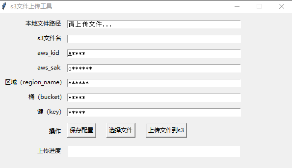

# AwsS3WindowsUploader
> aws s3 uploader for windows.  
> aws windows GUI界面文件上传小工具

# GUI

# config.ini
| ArgClass | Args | Detail | e.g |
| ---- | ---- | ---- | ---- |
| aws_account | aws_kid | aws IAM access key ID | A**** |
| aws_account | aws_sak | aws IAM secret access key | o**** |
| bucket_info | region_name | aws s3 region name 区域 | us-west-1 |
| bucket_info | bucket | your bucket name 你的桶名称 | mybucket |
| bucket_info | key | filename prefix 文件前缀 | myfolder |
